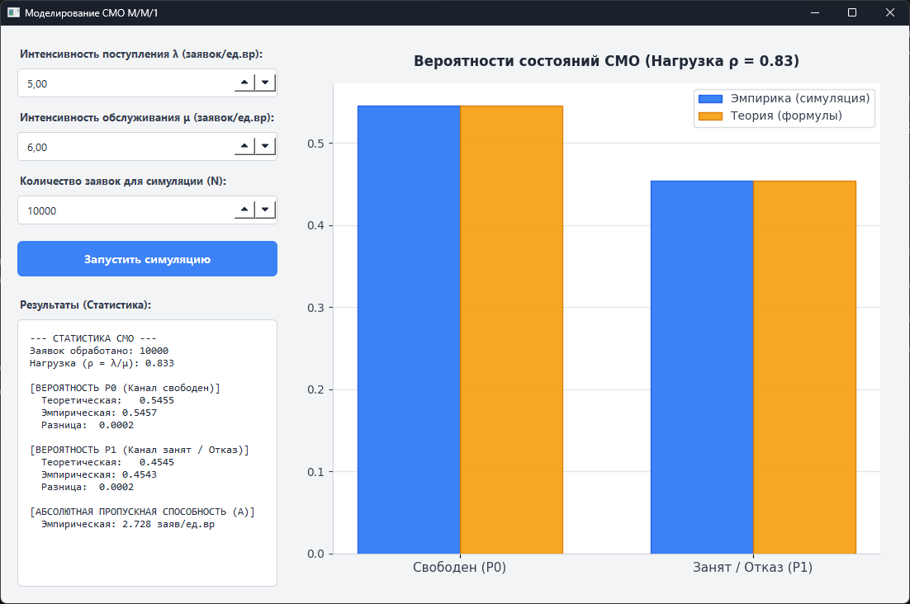

### Система массового обслуживания M/M/1

Моделирование простейшей системы M/M/1.  

## 1. Описание приложения

**Модуль настройки и управления**  
Программный комплекс позволяет моделировать поступление и обработку заявок сервером. Пользователю предоставляется интерактивная панель для настройки трех ключевых параметров:
*   **Интенсивность поступления $\lambda$** — среднее количество новых заявок, приходящих за единицу времени.
*   **Интенсивность обслуживания $\mu$** — среднее количество заявок, которое сервер способен обработать за единицу времени.
*   **Количество заявок $N$** — объем выборки (число смоделированных событий) для сбора статистических данных.

**Система визуализации и анализа**  
Окно приложения логически разделено на панель управления (слева) и область графиков (справа).
*   **Анализ вероятностей (График):** В правой части строится столбчатая диаграмма, наглядно сравнивающая эмпирические вероятности состояний системы (синие столбцы) с теоретически рассчитанными по формулам (оранжевые столбцы). Рассматриваются два состояния: прибор свободен ($P_0$) и прибор занят/отказ ($P_1$).
*   **Блок статистики и выводов:** В левой нижней части выводится подробный текстовый лог. В нем отображается нагрузка на систему $\rho$, вычисляются погрешности между теорией и практикой, а также рассчитывается абсолютная пропускная способность $A$ (число успешно обслуженных заявок в единицу времени).

## 2. Вероятностная модель

**Генерация потока и обслуживания (Марковский процесс)**  
Для СМО типа $M/M/1$  интервалы времени между поступлениями заявок $\Delta t_{вх}$ и время обслуживания заявки $t_{обсл}$ являются независимыми случайными величинами, подчиняющимися экспоненциальному закону:
$$f(\Delta t_{вх}) = \lambda e^{-\lambda \Delta t_{вх}}, \quad f(t_{обсл}) = \mu e^{-\mu t_{обсл}}$$
В программе это реализовано через генерацию массивов функцией `np.random.exponential`.

**Теоретические расчеты (Формулы Эрланга)**  
Ключевым параметром системы является приведенная интенсивность нагрузки $\rho = \frac{\lambda}{\mu}$. Поскольку в системе нет очереди, заявка, заставшая сервер занятым, покидает систему не обслуженной. Вероятности состояний рассчитываются по формулам:
*   Вероятность того, что канал свободен: $P_0 = \frac{1}{1 + \rho}$
*   Вероятность отказа (канал занят): $P_{отк} = P_1 = \frac{\rho}{1 + \rho}$
*   Абсолютная пропускная способность: $A = \lambda \cdot P_0$

**Ключевое свойство модели**  
Главным индикатором правильности работы симулятора является соответствие доли принятых и отклоненных заявок теоретическим вероятностям $P_0$ и $P_1$. Эмпирические вероятности считаются как $\hat{P_0} = \frac{N_{принято}}{N}$ и $\hat{P_1} = \frac{N_{отказано}}{N}$.

## 3. Графический интерфейс пользователя

## 4. Результаты моделирования

Для тестирования работоспособности модели были заданы следующие базовые параметры:
*   Интенсивность поступления ($\lambda$): **5.0**
*   Интенсивность обслуживания ($\mu$): **6.0**
*   Теоретическая нагрузка ($\rho$ = 5/6): **$\approx 0.833$**
*   Ожидаемое $P_0$: **0.5455** | Ожидаемое $P_1$: **0.4545**

**Таблица сходимости**

| Количество заявок ($N$) | Эмпирич. $P_0$ | Эмпирич. $P_1$ | Разница |
| --- | --- | --- |--------|
| **100** | 0.5700| 0.4300 | 0.0245 |
| **1 000** | 0.5360 | 0.4640 | 0.0095 |
| **10 000** | 0.5438 | 0.4562 | 0.0017 |
| **100 000** | 0.5455 | 0.4545 | 0.0001 |

*Примечание: Так как используется генератор псевдослучайных чисел, конкретные значения в последних знаках меняются при каждом новом запуске.*

## 5. Выводы

1.  **Подтверждение теоретической базы:** Симуляция работы сервера без очереди, основанная на сравнении абсолютного времени прихода заявки и времени освобождения прибора, успешно воспроизводит поведение СМО с отказами. Столбчатая диаграмма наглядно демонстрирует визуальное совпадение теоретических и эмпирических данных.
2.  **Свойство системы с отказами:** В ходе экспериментов подтверждено, что при высоких нагрузках (когда $\lambda$ приближается к $\mu$), система теряет значительную часть заявок. В тестовом случае ($\rho \approx 0.833$) почти $45\%$ всех приходящих запросов получили отказ, так как буфер для ожидания не предусмотрен моделью.
3.  **Закон больших чисел:** Анализ таблицы результатов показывает, что при малом количестве заявок (до 1000) наблюдаются статистические флуктуации — доля отказов может заметно отклоняться от математического ожидания. При увеличении числа экспериментов ($N \ge 10000$) эмпирические вероятности строго сходятся к теоретическим формулам Эрланга, что подтверждает корректность алгоритма симуляции.