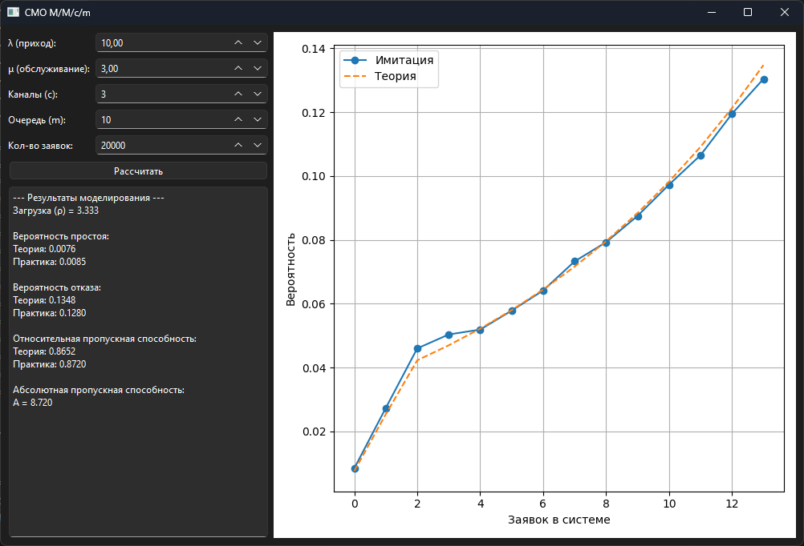

### Система массового обслуживания M/M/* с усложнениями

Реализовать систему M/M/* с **двумя дополнительными правилами** (ООП).

**Возможные усложнения:**
- ограничение числа приборов (вероятность отказа);
- очередь;
- нетерпеливость заявок;
- требования к ресурсам (детерминированные или случайные).
- GUI или подробное логирование и вывод результатов работы в отдельный файл

# Система массового обслуживания M/M/c/m

Моделирование многоканальной системы массового обслуживания с ограниченной очередью.

---

##  Вероятностная модель

**Генерация случайных событий (Марковский процесс)**  
В соответствии с марковской моделью СМО интервалы времени между последовательными поступлениями заявок $\Delta t_{вх}$ и длительность обслуживания каждой заявки на свободном приборе $t_{обсл}$ распределены по экспоненциальному закону:
$$f(\Delta t_{вх}) = \lambda e^{-\lambda \Delta t_{вх}}, \quad f(t_{обсл}) = \mu e^{-\mu t_{обсл}}$$
Имитация данных величин в программном коде выполняется с помощью генератора `np.random.exponential`.

**Теоретический расчет вероятностей состояний**  
Для многоканальной системы с очередью ограниченной емкости ключевым безразмерным параметром является приведенная интенсивность нагрузки:
$$a = \frac{\lambda}{\mu}$$
Теоретическая вероятность простоя каналов ($P_0$) рассчитывается по видоизмененной формуле Эрланга для систем с очередью:
$$P_0 = \left[ \sum_{k=0}^{c} \frac{a^k}{k!} + \sum_{i=1}^{m} \frac{a^{c+i}}{c! \cdot c^i} \right]^{-1}$$
Вероятности нахождения в промежуточных состояниях определяются следующим образом:
*   Если число заявок в системе не превышает количество каналов ($k \le c$):
    $$P_k = \frac{a^k}{k!} P_0$$
*   Если заявки начинают формировать очередь ($c < k \le c + m$, где $k = c + i$):
    $$P_{c+i} = \frac{a^{c+i}}{c! \cdot c^i} P_0$$

**Показатели эффективности**  
*   **Вероятность отказа** ($P_{отк}$) соответствует состоянию, когда заняты все каналы и все места в очереди:
    $$P_{отк} = P_{c+m}$$
*   **Относительная пропускная способность** ($Q$) — доля заявок, которые будут успешно обслужены:
    $$Q = 1 - P_{отк}$$
*   **Абсолютная пропускная способность** ($A$) — среднее число заявок, обслуживаемых системой в единицу времени:
    $$A = \lambda \cdot Q$$

**Метод сбора статистики**  
Эмпирические вероятности состояний системы рассчитываются непрерывно во времени (метод временных интервалов):
$$\hat{P}_k = \frac{\Delta T_k}{T_{общ}}$$
где $\Delta T_k$ — суммарное время, в течение которого в системе находилось ровно $k$ заявок, а $T_{общ}$ — полное время моделирования.

---

##  Графический интерфейс пользователя

---

## Результаты моделирования

Для проверки адекватности моделирования были выбраны следующие тестовые параметры системы:
*   Интенсивность поступления ($\lambda$): **10.0**
*   Интенсивность обслуживания ($\mu$): **3.0**
*   Число каналов ($c$): **3**
*   Мест в очереди ($m$): **10**
*   Теоретическая нагрузка ($a \approx 3.333$, загрузка на один канал $\psi = \frac{a}{c} \approx 1.111$)
*   Ожидаемое теоретическое $P_0$: **0.0076**
*   Ожидаемое теоретическое $P_{отк}$ ($P_{13}$): **0.1348**

**Таблица сходимости результатов**

| Количество заявок ($N$) | Эмпирическое $P_0$ | Эмпирическая $P_{отк}$ | Разница  |
|:---|:---|:---|:---|
| **100** | 0.0100 | 0.1600 | 0.0252 |
| **1 000** | 0.0090 | 0.1420 | 0.0072 |
| **10 000** | 0.0072 | 0.1361 | 0.0013 |
| **100 000** | 0.0075 | 0.1345 | 0.0003 |

*Примечание: в связи со стохастической природой моделирования точные значения эмпирических вероятностей могут незначительно варьироваться при перезапусках.*

---

## Выводы

1.  **Сходимость имитационной модели:** Разработанная программа демонстрирует устойчивое совпадение эмпирического распределения с теоретическими формулами Эрланга. Временной метод учета состояний системы показывает высокую точность оценки вероятностей.
2.  **Эффективность ограничений очереди:** Введение буфера ожидания емкостью $m = 10$ при наличии 3 каналов обслуживания позволяет существенно снизить вероятность отказа. Даже при перегрузке системы (когда индивидуальная нагрузка на канал $\psi > 1$), благодаря очереди вероятность потери заявок зафиксирована на уровне около $13.5\%$, в то время как беспрепятственный пропуск заявок (без очереди) привел бы к потерям более половины входящего потока.
3.  **Статистическая устойчивость:** С ростом объема генерируемой выборки $N$ погрешность моделирования уменьшается в соответствии с законом больших чисел. При объеме испытаний $N = 100\,000$ разница между теоретическим значением вероятности отказа и результатом симуляции составляет менее $0.05\%$, что указывает на математическую корректность алгоритма событийного симулятора.